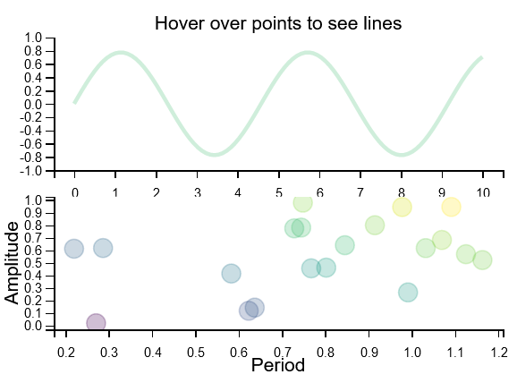
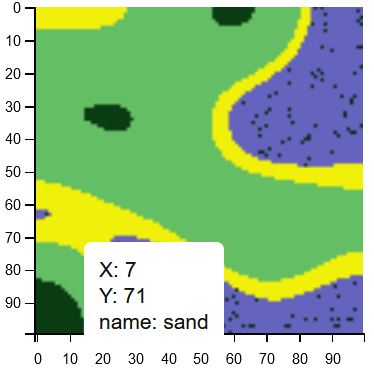

# Interactive Data Visualization Widgets with MPLD3 and Bokeh

This works is still undere development. All widgets are javascript-supported and can be embedded into HTML with ease to display in research project websites. Currently has: 

- Plot of samples where hovering each sample visualizes a corresponding curve on another plot

- An image plot with hover-over pixel information (e.g. XY coordinates and Tile type for a map-like image). The css style of the hover information is modifyable.
 

TODOs:

- Showcase interactive demos on a website
- Other widgets?  
